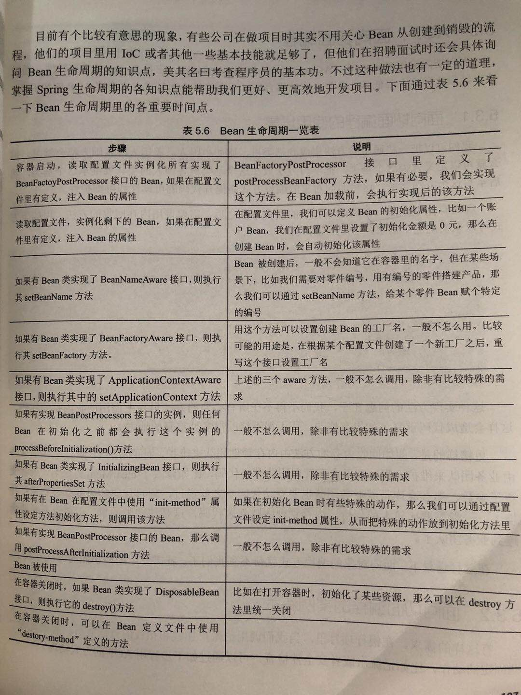

# 第5章 Spring的基本知识点分析

标签：后端开发

---

- Spring的技术点主要需要掌握四点
	- 第一点是常规知识点，比如SpringIoC和AOP等
	- 第二点是Web应用方面的Spring的MVC框架
	- 第三点是其他框架的整合技术，比如和Hibernate整合
	- 第四点是数据方面的应用，比如事务等
- 依赖注入IoC
	- 通过getBean的方式来获得类的实例，不用new就可以初始化了类，低耦合
	- 生产环境当需要对IoC类进行修改时，无需同原先进入调用类中进行修改(比如构造方法增加了参数),通过配置文件装载类,利于团队开发和维护
	- 一个例子：注意配置文件<property>的使用
> 1 [IDEA用maven创建springMVC项目和配置 https://www.cnblogs.com/shang-shang/p/7477607.html](https://www.cnblogs.com/shang-shang/p/7477607.html)
> 2 接口中的属性的默认是public static final 、方法是public abstract
	- 两个概念
		- 控制反转IoC：类之间的关系，不用代码控制，而是由Spring容器（也就是Spring的jar包）来控制。控制权由代码反转到容器里，这叫控制反转。所以，使用时将类的关系卸载配置文件里，初始化对象时在代码里无需new
		- 依赖注入DI：在代码运行时，如果我们要在一个类里使用（也叫注入）另一个类，比如例子中SayHello依赖于HelloWorldSpring，这里这种注入就是依赖于配置文件的。因此在使用时，同上会根据配置文件将需要的类注入
- 读取配置文件的各种方式
	- XmlBeanFactory
	```
	Resource resource=new ClassPathResource("bean.xml");
	BeanFActory factory=new XmlBeanFactory(resource);
	```
	- ClassPathXmlApplciationContext
	```
	Application ctx=new ClassPathXmlApplicationContext("conf/application.xml");
	```
	- FileSystemXmlApplicationContext
	```
	ApplicationContext factory=new FileSystemXmlApplicationContext("classpath:appcontext.xml");
	```
- 单例多例，有状态无状态Bean
	- 单例
		`<bean name="SayHello" class="com.SayHello" scope="singleton">(默认)`	
	- 多例
		`<bean name="SayHello" class="com.SayHello" scope="prototype">`	
	- 有状态Bean
		- 使用场景：当用户在网站登陆后，系统可以用一个有状态的Bean来记录我们的访问信息，比如来源IP访问页面列表和访问时间等
		- 特点：每次调用会创建一个实例，一旦调用结束，比如用户离开了网站，则该bean会被销毁
	- 无状态Bean
		- 使用场景：数据库连接的通用类，其他类可以用来获取数据库连接并进行操作
		- 特点：可以在缓冲池里只维护一个实例，无需创建和销毁操作，性能高，但是线程不安全
- 注意通过面向接口自由组装降低耦合
- 类似prototype和ref外的注入方法
	- 1 通常，依赖注入可使用prototype和ref配置另一个类
	- 2 也可以使用autowire参数配置，常见有no,byName,byType,constructor,autodetect,defaul，常用byName,byType，无需配置prototype，只需对需要注入的类配置autowire=参数，会根据xml配置文件相应的name或type进行查找，若出现两个相同的type（如com.HelloWorldSpring）会报错
	- 3 使用@Autowired注解进行注入，相等于autowire="byType"
		- 面试考察注解注入的缺点，可回答 第一、代码可读性不好，不容易维护，因为我们不得不在代码里找到依赖关系；第二、通用性不好，比如哪天我们的代码不用Spring了，那么我们就得一个个删除
	- 4 也可以通过@Resource注解来装载，不过它等同于autowire=“name”
- Bean的生命周期一览表

- AOP面向切面编程
	- 优点：耦合度低
	- 具体应用场景：如银行业务，如果要更改价钱和扣钱的前置操作，本来是要做安全验证，现在还要添加反洗钱管理，那么价钱和扣钱着两个方法本身不要做改动
	- 几个概念
		- 通知Advice：有5种类型的通知，Before，After，Around，After0returning和After-throwing
		- 连接点和切入点：任何可能出发通知的都是连接点，而真正进行切入执行通知的位置叫做切入点
		- 切面：通知和切入点的结合，例如在调用add方法之前像打印日志，这种需求就是切面
		- 目标：比如上文的Account类，就可以是目标
	- 常见考察点
		- 第一 有哪些通知的类型
		- 第二 结合项目说明你是如何使用AOP的
		- 第三 如果牵制通知只想作用在某些方法上，不想作用在全部方法上，该怎么做？
		- 第四 也可以通过注解而不是配置文件实现面向切面编程，这种做法的局限性是？
- 关于Spring的技能知识证明
	- 1 能结合实际说出Spring的优势，比如能说出面向接口自由组装降低耦合之类特性在他的项目是怎么实现的，或者给它们的项目带来了哪些具体的好处
	- 2 注意结合项目回到Spring的相关内容，从而体现是否使用过Spring以及是否精通
	- 3 可以讲出使用Spring时走的一些弯路，有哪些经验体会。可以回答用注解对项目维护带来问题，或者是用单例创建Bean的时候对多线程之间的调用带来了一定的问题
	- 4 可以说出Spring里Bean的生命周期和源代码这两方面，这属于较自身的内容
	- 5 至于Spring内核实现IoC和AOP的源代码，若能回答出是个加分项
- 面试常考察点
	- 1 需要候选人结合实际Spring项目说明时如何使用IoC的
		- 不难，要注意结合具体的项目，比如在银行项目里一个管理账户的类可以通过IoC的特性动态地加载另外一个管理安全风险地类，这样能减少耦合度
	- 2 请结合项目说明你用过哪些autowired的种类
	- 3 请说明你用过哪些注解
		- @Autowired的注解外，还可以说下用注解的坏处，体现做了不少Spring项目
	- 4 如何实现单例，如何实现多例，结合项目说下哪种情况下使用单例模式或多例模式创建Bean
		- 结合单例、多例、有状态、无状态回答。根据你的需求确定
	- 5 具体说下Bean的生命周期，说下你重写过其中的哪些方法。或者温，如果要给Bean编号，该怎样做？或者该如何设置Spring的初始化方法。总之，当你了解了Spring生命周期里各节点，遇到实际需求后，你就能清楚地了解该重写哪些方法来解决
	- 6 说下你在项目中如何使用AOP，大多数候选人都说用AOP来实现日志打印
	- 7 说下你在项目里具体用过哪些AOP，比如前置、后置、环绕等
		- 注意不是越多越好，可以结合回答AOP的5中通知类型有哪些，并且只有在合适的场合使用恰当才是号的