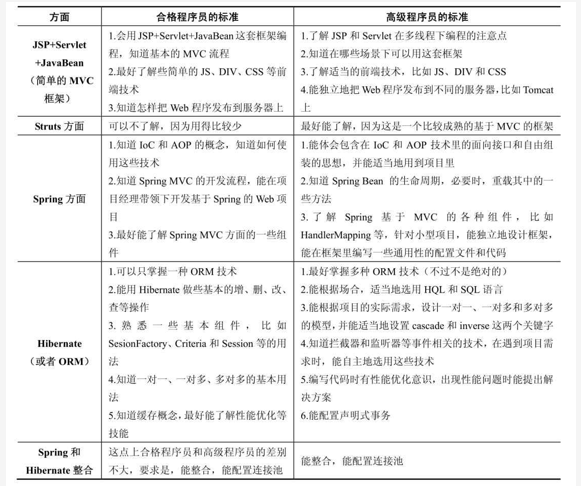
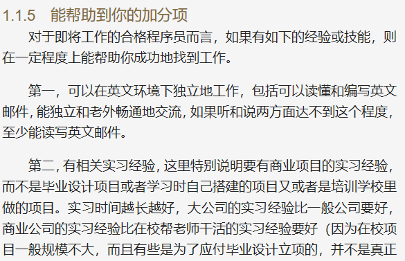

# 第一章 高级程序员的Web知识体系

标签：后端开发

---

## Java程序员的技能需要

### 一 Java Core

### 二 Java Web

### 三 数据库

### 四 项目管理

### 五 加分项

---

## Web相关的开发工具

- 该书介绍了MyEclipse，有些公司使用Eclipse加其他插件的开发方式，方式基本相同
- 修改MyEclipse支持中文的方法：在Window->Preference->General->Workspace->Text File encoding->choose Other:ISO-8809-1(or UTF-8);只对某一具体文件可通过右键Properties指定字符集同